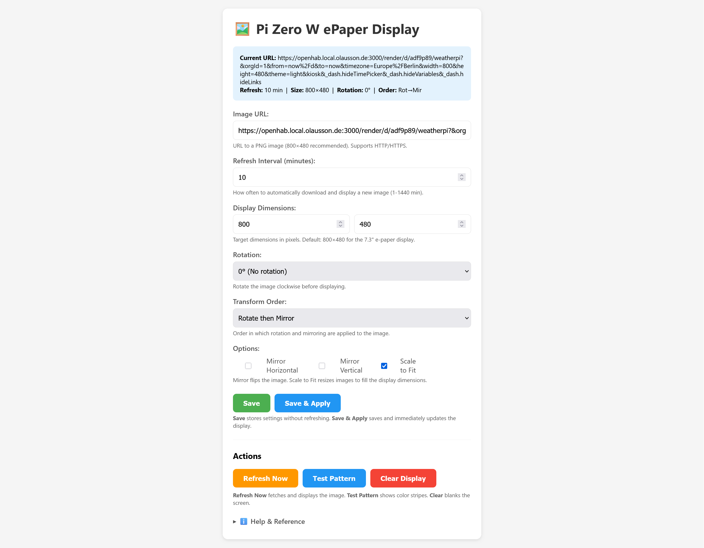

# RPi Zero W E-Paper Display

A lightweight, memory-efficient Rust application that turns a Raspberry Pi Zero W into a dedicated e-paper display server. Designed for the Waveshare 7.3" E Ink Spectra 6 (E6) Full Color E-Paper Display.

## Features

- **Web Configuration Interface** — Configure image URL, refresh schedule, rotation, and mirroring from any browser
- **Multiple Schedule Plans** — Create named schedule plans (e.g., "Weekday", "Weekend") with different refresh intervals
- **Per-Day Schedule Assignment** — Assign different schedule plans to each day of the week
- **Time-Based Refresh Scheduling** — Configure different refresh intervals for different times of day within each plan
- **Schedule Presets** — Quick setup with Simple (24h), Day/Night, or Work Hours presets
- **Image Processing Pipeline** — Automatic scaling, rotation, mirroring, and Floyd-Steinberg dithering to the 6-color palette
- **Grafana Integration** — Perfect for displaying dashboards, weather data, or any rendered image
- **Resource Efficient** — Optimized for the Pi Zero W's limited resources (~3MB binary, minimal memory footprint)
- **Systemd Service** — Runs as a background service with automatic startup
- **Backward Compatible** — Automatically migrates legacy configurations to the new schedule format

## Web Interface



Configure the display through a clean, mobile-friendly web interface. Features include:
- Image URL configuration with HTTP/HTTPS support
- Multiple named schedule plans with tabbed interface
- Per-day schedule assignment with visual day-of-week grid
- Time-based refresh periods within each plan
- Schedule presets for common use cases (Simple, Day/Night, Work Hours)
- Configurable display dimensions
- Rotation (0°, 90°, 180°, 270°)
- Horizontal and vertical mirroring
- Scale-to-fit option for automatic image resizing
- Quick actions: Refresh Now, Test Pattern, Clear Display

## Supported Hardware

- **Raspberry Pi Zero W** (or any Raspberry Pi with GPIO/SPI)
- **Waveshare 7.3" E Ink Spectra 6 (E6) Full Color E-Paper Display** (800×480)
  - Model: EPD7IN3E
  - Colors: Black, White, Red, Yellow, Blue, Green (6 colors)

## Installation

### Prerequisites

- Raspberry Pi with Raspberry Pi OS (Lite recommended)
- SPI enabled (`sudo raspi-config` → Interface Options → SPI)
- Display connected to GPIO header

### Quick Install

1. Download the latest release binary
2. Copy to the Pi:
   ```bash
   scp epaper-display pi@<your-pi-ip>:/tmp/
   ```
3. Install:
   ```bash
   sudo mkdir -p /opt/epaper-display
   sudo mv /tmp/epaper-display /opt/epaper-display/
   sudo chmod +x /opt/epaper-display/epaper-display
   ```
4. Create config file `/opt/epaper-display/config.json`:
   ```json
   {
     "image_url": "",
     "schedule_plans": [
       {
         "name": "Default",
         "periods": [
           { "start_time": "00:00", "end_time": "00:00", "interval_min": 60 }
         ]
       }
     ],
     "day_assignments": {
       "Mon": "Default",
       "Tue": "Default",
       "Wed": "Default",
       "Thu": "Default",
       "Fri": "Default",
       "Sat": "Default",
       "Sun": "Default"
     },
     "rotation": 0,
     "mirror_h": false,
     "mirror_v": false,
     "scale_to_fit": true
   }
   ```
5. Run:
   ```bash
   sudo /opt/epaper-display/epaper-display --config /opt/epaper-display/config.json --port 8888
   ```
6. Open `http://<your-pi-ip>:8888` in a browser

### Systemd Service

Create `/etc/systemd/system/epaper-display.service`:

```ini
[Unit]
Description=E-Paper Display Server
After=network.target

[Service]
Type=simple
ExecStart=/opt/epaper-display/epaper-display --config /opt/epaper-display/config.json
Restart=always
RestartSec=10

[Install]
WantedBy=multi-user.target
```

Enable and start:
```bash
sudo systemctl daemon-reload
sudo systemctl enable epaper-display
sudo systemctl start epaper-display
```

## Configuration

| Setting | Description | Default |
|---------|-------------|---------|
| `image_url` | URL to fetch the image from | `""` |
| `schedule_plans` | Array of named schedule plans (see below) | Single "Default" plan |
| `day_assignments` | Map of weekday to schedule plan name | All days → "Default" |
| `display_width` | Target display width in pixels | `800` |
| `display_height` | Target display height in pixels | `480` |
| `rotation` | Image rotation (0, 90, 180, 270) | `0` |
| `rotate_first` | Apply rotation before mirroring | `true` |
| `mirror_h` | Mirror image horizontally | `false` |
| `mirror_v` | Mirror image vertically | `false` |
| `scale_to_fit` | Scale image to fill display | `true` |
| `web_port` | Web server port | `8888` |
| `verbose` | Enable verbose logging | `false` |

### Schedule Plans

Schedule plans allow you to define different refresh schedules and assign them to specific days of the week. Each plan contains an array of time-based periods.

**Schedule Plan Structure:**
- `name` — Unique name for the plan (e.g., "Weekday", "Weekend")
- `periods` — Array of time periods, each with:
  - `start_time` — Start time in HH:MM format (24-hour)
  - `end_time` — End time in HH:MM format (24-hour)
  - `interval_min` — Refresh interval in minutes for this period

Periods within a plan must cover all 24 hours without gaps or overlaps. Use `00:00` to `00:00` for a single 24-hour period.

**Example: Weekday/Weekend Schedules**
```json
{
  "schedule_plans": [
    {
      "name": "Weekday",
      "periods": [
        { "start_time": "06:00", "end_time": "09:00", "interval_min": 5 },
        { "start_time": "09:00", "end_time": "18:00", "interval_min": 15 },
        { "start_time": "18:00", "end_time": "22:00", "interval_min": 10 },
        { "start_time": "22:00", "end_time": "06:00", "interval_min": 60 }
      ]
    },
    {
      "name": "Weekend",
      "periods": [
        { "start_time": "08:00", "end_time": "23:00", "interval_min": 30 },
        { "start_time": "23:00", "end_time": "08:00", "interval_min": 120 }
      ]
    }
  ],
  "day_assignments": {
    "Mon": "Weekday",
    "Tue": "Weekday",
    "Wed": "Weekday",
    "Thu": "Weekday",
    "Fri": "Weekday",
    "Sat": "Weekend",
    "Sun": "Weekend"
  }
}
```

**Example: Simple 24-Hour Schedule**
```json
{
  "schedule_plans": [
    {
      "name": "Default",
      "periods": [
        { "start_time": "00:00", "end_time": "00:00", "interval_min": 60 }
      ]
    }
  ],
  "day_assignments": {
    "Mon": "Default",
    "Tue": "Default",
    "Wed": "Default",
    "Thu": "Default",
    "Fri": "Default",
    "Sat": "Default",
    "Sun": "Default"
  }
}
```

## Building from Source

### Requirements

- Rust toolchain (1.70+)
- Cross-compilation target: `aarch64-unknown-linux-gnu`

### Build

```bash
# Add target
rustup target add aarch64-unknown-linux-gnu

# Build release
cargo build --release --target aarch64-unknown-linux-gnu
```

The binary will be at `target/aarch64-unknown-linux-gnu/release/rpizerow-epaper-display`.

## Use Cases

- **Home Dashboard** — Display weather, calendar, or smart home status
- **Grafana Dashboards** — Render and display monitoring dashboards
- **Digital Signage** — Low-power information display
- **Art Display** — Show rotating artwork or photos

## License

MIT License - See [LICENSE](LICENSE) for details.